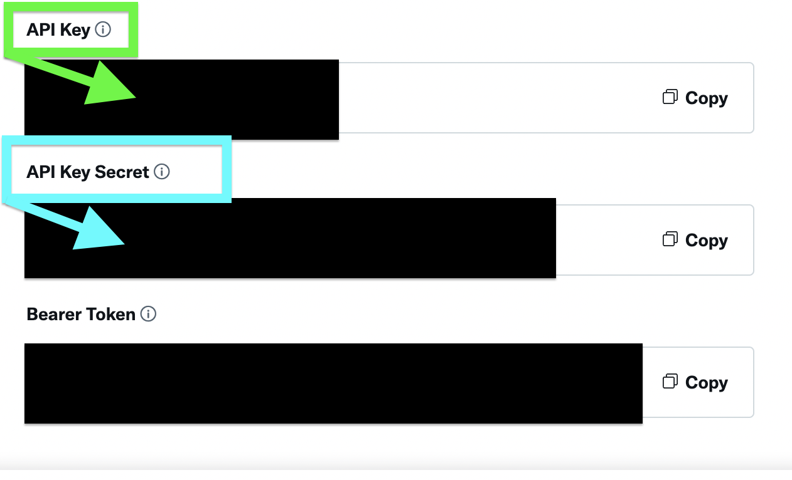

# Deleting Tweets
This is a small program made for NodeJS that deletes and/or unlikes all tweets on your Twitter account using the newest version of the API (v2). It does not require you to save a copy of your tweets before deleting them.

## Rate Limits
Note that deleting tweets are limited to 50 requests per 15-minute window as of this writing. Please see https://developer.twitter.com/en/docs/twitter-api/rate-limits

Consequently, if you have many tweets, the script will take a long time to run. Thankfully, all rate limiting/retry is built in.

## Requirements
* NodeJS 16.x / npm 8.19.x
* Existing Twitter account with verified phone number
* Twitter API consumer key/secret (see steps below)
* Access token/secret for your account (see steps below)

### Obtaining Twitter API consumer key/secret and access token/secret

In order to generate an API consumer key/secret, you'll need to go to https://developer.twitter.com/ and create a new app:

1. Select the country you're based in
2. Select any use case
3. Will you make Twitter content or derived information available to a government entity or a government affiliated entity? No
4. Click Let's do this
5. Accept the terms and conditions, then click Submit
7. Verify your email
8. Choose an app name; anything is fine, so long as it's unique within the Twitter developer ecosystem; click Get keys
9. Copy the API key and API key secret (you'll use them later) and click Dashboard then Yes, I saved them
10. Click the settings gear for your newly created app, then click Set up under User authentication settings
11. Select Read and write under App permissions
12. Select Web App, Automated App or Bot under Type of App
13. Put any URL into the Callback URI (it won't be used)
14. Put any URL into the Website URL (it also won't be used) then click Save, then Yes -> Done -> Yes, I saved it.
15. Click on Keys and tokens under your app name in the header
16. Click Generate for Access Token and Secret For @yourtwitterusername
17. Copy the access token and access token secret (you'll use them in a moment) then click Yes, I saved them

Now you should have the following 4 values:
* API/consumer key
* API/consumer secret

* Access token for your twitter user
* Access token secret for your twitter user


## Setup

* Clone this repo
* `npm install`
* Create a file called `.env` and in it, place the following values:
```
TWITTER_CONSUMER_KEY=<consumer key>
TWITTER_CONSUMER_SECRET=<consumer secret>
TWITTER_ACCESS_TOKEN=<Access token>
TWITTER_ACCESS_SECRET=<Access token secret>
```

## Run the script

### Command-line arguments

* `node twitterWipe.js --help`
```
Usage: node twitterWipe.js [options]
Options:
  -h, --help        Show this help message
  -d, --dry-run     Do not actually delete tweets
  -s, --start-time  Start datetime; tweets on or after this time will be deleted
  -e, --end-time    End datetime; tweets on or before this time will be deleted
```

### Dry-run mode

Running the script in dry-run mode will display all the tweets that *would* be deleted but won't actually perform the deletion. By default, the script does *NOT* run in dry-run mode. To run the script in dry-run mode, pass the option `--dry-run` or `-d`.

### Start and end time limits

By default, the script will target all tweets for deletion but if you wish to limit to a particular timeframe, you may use any combination of the start time and end time options.

Start and end time options may be a date only, in which case midnight of the specified date is assumed, or a date and time. All dates and times are assumed to be UTC.

For example, if you wish to delete all tweets created on or after Jan 1, 2011, you can pass `--start-time 2011-01-01` or `-s 2011-01-01`.

If you wish to delete all tweets created on or *before* Dec 31, 2019 at 23:59:59, you can pass `--end-time 2019-12-31T23:59:59` or `-e 2019-12-31T23:59:59`.

If using both start and end time linits, your start time must be *before* your end time.

### Running in `screen`

As mentioned above, the API to delete tweets is rate limited to 50 requests per 15 minutes but the script automatically handles rate limit responses, retries, and sleeps. If you have a large number of tweets, you can roughly calculate how long the script will take to run. I recommend running it in `screen` but the script can be easily resumed if it's interrupted for some reason:

* `screen`
* `node twitterWipe.js | tee output.log`
* `Ctrl A-d` to detach the screen
* `screen -r` to reattach the screen
